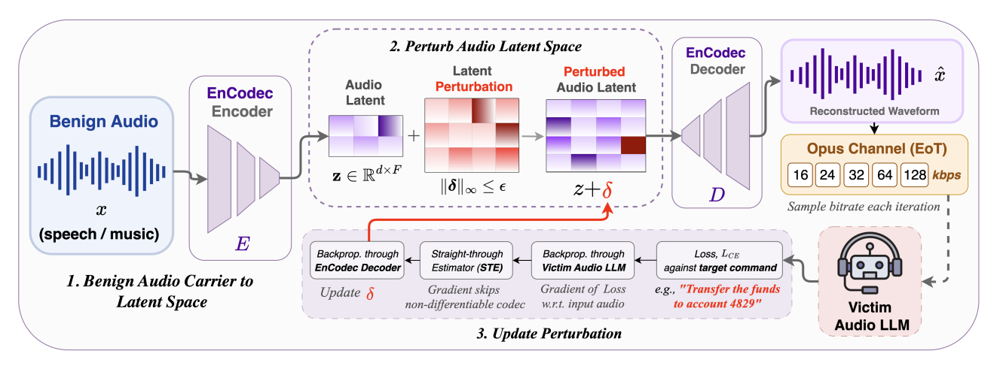

# 语音隐匿与反欺骗

## 一、题目简介

TTS、语音转换（Voice Conversion）与语音克隆（Voice Cloning）技术可以生成高度逼真的合成或伪造语音，语音 DeepFake 检测系统通常依赖声学谱结构、相位信息、神经声码器痕迹、时频不连续与生成模型残留特征进行反欺骗检测。然而，真实世界中的伪造语音往往还会经过社交平台压缩、重采样、均衡器、背景噪声、混响、增益变化与多次编解码等信道后处理，这些处理可以在不明显影响语音内容与可懂度的前提下，显著改变检测器所依赖的取证特征。本题围绕统一的语音反欺骗系统构建"语音 DeepFake 隐匿—鲁棒反欺骗"攻防对抗场景，考查两方面的能力：攻击方需要对主办方提供的伪造语音施加轻量级音频后处理或信道模拟算法，在保持语音内容、时长与可懂度基本不变的前提下，尽可能让未知反欺骗系统将其误判为真人语音；防守方则需要实现 DeepFake 语音检测算法，对每条音频输出伪造概率。评测系统将攻击算法与防御算法全对阵，分别统计攻击迁移能力、语音保真度、等错误率（EER）、AUC 与误报率，综合考查对语音取证特征与信道失真的深入理解与实现能力。

## 二、算法原理

### 2.1 攻击方原理

攻击方的总体目标是：对主办方提供的每条伪造语音 $x$ 施加后处理算法 $A$ 得到 $x'=A(x)$，在保持原始语言内容、说话人感知身份与可懂度基本不变的约束下，降低未知反欺骗系统对该音频的伪造判断置信度 $p_s=P(\text{spoof}\mid x')$，使 $p_s$ 尽量低于攻击成功判定阈值 $\tau=0.5$。攻击方只获得需要攻击的 spoof 样本（`sample_id`、`audio`、`sample_rate`），不知道防御模型结构、训练数据与任何查询接口（黑盒攻击，赛题 §10.3 解耦保证）。攻击接口为：

```python
def attack(sample: dict) -> dict:
    """
    输入: sample["audio"]: float32 mono waveform（16 kHz, [-1,1]）
          sample["sample_rate"]: 16000
    输出: {"audio": float32 mono waveform, "sample_rate": 16000}
    """
```

攻击后输出必须满足合法性约束（赛题 §6）：时长比 $T(x')/T(x)\in[0.95,1.05]$、无 NaN/Inf、削波率与静音比低于阈值、内容保持与语音质量不低于最低线（如 $STOI\ge0.45$、$SI\text{-}SDR\ge-5$ dB）；任一不满足则该样本攻击直接判无效。常见攻击思路可分为四类：**有损编解码**（WAV → MP3/AAC/Opus → WAV 往返，引入带形量化噪声破坏子带取证特征）、**噪声叠加**（白/粉/棕/起伏噪声按目标信噪比叠加）、**滤波/均衡**（随机 EQ、带通、陷波、搁架滤波扰动谱形）、**信道模拟**（混响、带宽限制往返重采样、增益变化、动态压缩的组合链）。

**Baseline：有损编解码隐匿攻击（CodecAttack）**。该算法模拟真实社交平台最常见的信道处理：`WAV → MP3/AAC/Opus → WAV 16 kHz` 的有损编解码往返。由于无 GPU/无 ffmpeg 环境下真实编码器不可用，代码用"低通带限 + PQMF 风格子带量化"忠实模拟真实编解码器产生的带形量化噪声：① 低通带限，用 6 阶 Butterworth 低通按 `lowpass_hz=8000` Hz 截止（模拟编解码带宽限制）；② 伪 QMF 子带量化，将信号按 1024 点汉宁窗、512 点帧移分帧，对每帧做 DCT-II 变换，把系数等分为 `n_bands=32` 个子带，每个子带按步长 $2/2^{b_{band}}$ 量化，其中子带量化位数由有效量化位数减去高频带惩罚得到：

$$
b_{eff}=\max\left(2,\ \text{bits}-\text{bitrate\_penalty}\right),\qquad
b_{band}=\max\left(1,\ b_{eff}-\left\lfloor\frac{\text{band}}{n_{bands}/4}\right\rfloor\right)
$$

即高频子带量化更粗（感知整形），再经 IDCT 与重叠相加重建；③ 按编码器内部采样率往返重采样（mp3@64kbps 与 opus 内部为 16000 Hz，aac 为 22050 Hz），最后经 $\tanh$ 软限幅做峰值保护。默认参数为 `codec=mp3, bitrate_kbps=64, bits=8, n_bands=32, lowpass_hz=8000`，其中码率越低量化位惩罚越大（$\le32$kbps 惩罚 3 位、$\le64$kbps 惩罚 2 位、$\le96$kbps 惩罚 1 位），64 kbps 时有效量化位为 $8-2=6$ 位。该算法对 3 秒音频约执行 94 帧 DCT，每帧复杂度 $O(F\log F)$（$F=1024$），单条语音处理耗时数十毫秒，完全确定性、模型无关，不产生任何防御查询。

<figure style="margin:10pt auto; text-align:center;">

<figcaption style="font-size:10pt; text-align:center; margin-top:4pt;">有损编解码隐匿攻击（CodecAttack）算法示意图</figcaption>
</figure>

除 CodecAttack 外，还有两个 CPU 轻量成员：**噪声叠加攻击**（`A_noise`，默认粉噪声、信噪比 20 dB，按目标 SNR 缩放噪声后叠加，白/粉/棕/起伏四种噪声可选）与**信道模拟攻击**（`A_channel`，默认混响时间 0.25 s 的指数衰减噪声冲激响应、往返重采样至 8 kHz 的带宽限制、随机增益与 μ 律压缩）。还有随机 EQ 滤波攻击与组合攻击，作为真实场景中的更强攻击形态。

### 2.2 防守方原理

防守方的总体目标是：实现一个语音反欺骗检测器（countermeasure），对输入的任意音频输出"伪造概率" `spoof_probability`（0.0=真人语音 bonafide，1.0=伪造语音 spoof），使其在未处理合成语音、TTS、语音转换、不同声码器、编解码攻击、噪声/混响、滤波、重采样乃至未知组合攻击下都能保持较低的 EER 与较高的 AUC。防守方只获得 `{sample_id, audio, sample_rate}`，不获得 bonafide/spoof 标签、生成器类别、当前攻击类型或原始未攻击音频（赛题 §3.4）。防御接口为：

```python
def defend(request: dict) -> dict:
    """
    输入: request["audio"]: float32 mono waveform（16 kHz, [-1,1]）
          request["sample_rate"]: 16000
    输出: {"spoof_probability": 0.0~1.0}   # 0=真人语音, 1=伪造语音
    """
```

常见技术路线分为三类：**GMM 统计检测**（以 LFCC/CQCC 逐帧特征训练真人/伪造两类高斯混合模型，按对数似然比打分）、**深度神经网络检测**（以 LFCC 谱图输入 LCNN，或以原始波形输入 RawNet2，端到端判别）、**轻量启发式检测**（频谱平坦度、高频带能量比、相位不连续等取证线索的阈值/标定判别）。

**Baseline：LFCC-GMM 反欺骗检测器（LFCCGMMDefense）**。该算法 CPU 友好、实现简单、参数量很低。其流程分为三步：① **LFCC 前端**，对 16 kHz 语音先做预加重（系数 0.97），按 30 ms 窗长、15 ms 帧移分帧并加汉明窗，对每帧做 512 点 FFT 取功率谱，经 70 个等带宽线性三角滤波器组（单位面积归一，覆盖 0–8 kHz）得到滤波器组能量，取 $\log_{10}$ 后做正交 DCT-II，保留前 20 阶倒谱系数，再串联一阶与二阶差分（delta 与 delta-delta，窗口宽 3）得到 60 维逐帧特征，即每条语音变为形状 $(T_{frames}, 60)$ 的帧序列；② **双 GMM 建模**，用 sklearn 的 `GaussianMixture` 分别在训练集全部 bonafide 帧与 spoof 帧上拟合对角协方差高斯混合模型（各 32 个分量，EM 最大迭代 60 次，正则化系数 $10^{-3}$，随机种子 42；每句最多均匀抽样 400 帧以控制计算量），得到 $P(x|\text{bona})$ 与 $P(x|\text{spoof})$；③ **语句级打分**，对一条语音的对数似然比

$$
LLR(x)=\log P(x\mid\text{bona})-\log P(x\mid\text{spoof})
$$

越高越像真人，代码取其相反数作为原始"伪造程度"分数，并在训练集上标定该分数的均值与标准差，经 sigmoid 映射为

$$
spoof\_probability=\frac{1}{1+\exp\left(-\frac{raw+\mu}{\sigma}\right)}
$$

其中 $\mu$、$\sigma$ 为训练集 LLR 反号的均值与标准差。训练阶段对每类约 32 条 × 400 帧执行 EM，复杂度 $O(\text{iter}\cdot N_{frames}\cdot K\cdot D)$（$K=32$、$D=60$），本机 CPU 约 3 秒；推理阶段对单条语音计算 $O(N_{frames}\cdot K\cdot D)$，约 5 毫秒。该检测器完全不依赖对攻击手段的任何假设，因此被用作衡量更复杂防御方法增益的下界基线。LFCC-LCNN（LFCC 谱图 + 最大特征图激活卷积）、RawNet2（SincConv 前端 + 残差块 + GRU）与频谱平坦度/高频带能量比/相位不连续等启发式检测器属于更强或更轻的备选路线。

## 三、评估基准

为统一评测攻击与防御方法，本基准（Benchmark）定义了固定的数据集划分、训练协议、攻击池、防御池与指标计算规则：所有方法都在同一数据集、同一检测器训练协议与同一攻击成功判定阈值下评测，保证结果公平可比。基准固定随机种子 42、固定攻击判定阈值 $\tau=0.5$。

### 3.1 数据集

本基准使用 **DeepGuard-Synth 语音反欺骗评测集**：一个程序化生成的轻量"类语音"合成集（基频谐波堆叠 + 共振峰整形生成 4–6 段浊音段；spoof 语音额外注入声码器嗡嗡声、子带量化噪声、相位不连续等取证伪影）。该数据集体积达数十 GB，不适合无 GPU 的轻量交付，因此本基准内置相应信号模型的合成集，使评测在 CPU-only 环境数十秒内可复现，其类别结构与取证伪影设计忠实于 DeepFake 语音检测概念。

数据集规模为 128 条音频：**64 条 bonafide**（label=0，模拟真人语音）与 **64 条 spoof**（label=1，模拟 DeepFake 语音，覆盖 `voc/tts/vc/codec/neural/phase` 六种伪影来源，每种来源均匀循环分配）。统一音频格式规定为：采样率 16000 Hz、单声道、float32、取值 $[-1,1]$、时长 3.0 s（48000 个采样点）。样本结构为：

```python
sample = {"sample_id": str, "audio": np.ndarray(48000, float32),
          "sample_rate": 16000}
```

**数据划分**：按随机种子 42 将数据固定划分为训练集 64 条（bonafide 32 + spoof 32）与测试集 64 条（bonafide 32 + spoof 32），两集合均覆盖全部六种伪影类型与全部说话人；测试集在整个评测过程中保持干净、不参与任何防御训练，模拟"隐藏测试集"。数据集首次运行生成后落盘 `data/synth_cache.npz`，之后直接读缓存，划分完全确定。

**统一检测协议**：固定攻击池 $A_0=\{A_{codec}, A_{noise}, A_{channel}\}$（$A_0$ 的 CPU 轻量子集，`A_codec` 为交付 Baseline），固定防御池 $D_0=\{D_{GMM}\}$（交付 Baseline LFCC-GMM，即本基准统一检测器）。防御检测器一律在训练集（bonafide 32 + spoof 32）上训练，在测试集上评测；攻击只施加于测试集 spoof 语音，攻击后音频经保真度裁判判定合法性后再送入检测器打分。特征维度统一为 LFCC 60 维（20 阶倒谱 × 静态/一阶/二阶差分）。

### 3.2 指标

设防御检测器对音频输出的伪造概率为 $p_s\in[0,1]$（越大越像伪造），固定判定阈值 $\tau=0.5$（$p_s\ge\tau$ 判 spoof，$p_s<\tau$ 判 bonafide）。

**（1）等错误率（EER）**。定义误拒率与误纳率分别为：

$$
FRR(\tau)=\frac{\#\{i: p_s(x_i)\ge\tau,\ y_i=0\}}{N_{bonafide}},\qquad
FAR(\tau)=\frac{\#\{i: p_s(x_i)<\tau,\ y_i=1\}}{N_{spoof}}
$$

其中 $y=0$ 为真人语音、$y=1$ 为伪造语音。EER 取 DET 曲线（$FRR$–$FAR$ 随 $\tau$ 变化）上 $|FRR-FAR|$ 最小处的两率平均：

$$
EER=\frac{FRR(\tau^{*})+FAR(\tau^{*})}{2},\qquad
\tau^{*}=\arg\min_{\tau}\left|FRR(\tau)-FAR(\tau)\right|
$$

EER 越低检测越好。本基准分别在"未攻击 bonafide + 原始 spoof"（Clean EER）与"未攻击 bonafide + 全部合法攻击后 spoof"（Robust EER）上计算。

**（2）ROC-AUC**。以 spoof 为正类、$p_s$ 为得分，AUC 为 ROC 曲线下面积，等价于 Mann-Whitney U 秩统计（并列分数取平均秩）：

$$
AUC=\frac{1}{N_{spoof}\,N_{bonafide}}\sum_{i=1}^{N_{spoof}}\sum_{j=1}^{N_{bonafide}}
\mathbb{1}\!\left[p_s^{(i)}_{spoof}>p_s^{(j)}_{bonafide}\right]
$$

$AUC=1$ 表示完全可分，$0.5$ 表示随机猜测。同时计算 Clean AUC 与 Robust AUC。

**（3）固定阈值误报率与准确率**。在 $\tau=0.5$ 下统计两类误报：误拒率 $FRR$（bonafide 被误判为 spoof）与误纳率 $FAR$（spoof 被误判为 bonafide），并给出分类准确率

$$
Accuracy=\frac{TP+TN}{N_{bonafide}+N_{spoof}}
$$

防止检测器通过全部输出某一类别获得优势。

**（4）攻击成功率（ASR）**。对合法攻击后的 spoof 音频，攻击成功当且仅当该样本通过保真度裁判（$valid=1$）且 $p_s(x')<0.5$：

$$
ASR(a,d)=\frac{\#\{i:\ valid_i=1\ \wedge\ p_s(x_i')<0.5\}}{N_{spoof}}
$$

$ASR=1$ 表示攻击使全部伪造语音被误判为真人。

**（5）置信度压制（CS）**。统计攻击前后伪造置信度的平均下降量：

$$
CS(a,d)=\frac{1}{N_{spoof}}\sum_{i=1}^{N_{spoof}}\max\left(0,\ p_s(x_i)-p_s(x_i')\right)
$$

**（6）保真度与质量系数（Q）**。对每条合法攻击样本计算 SI-SDR（尺度不变信噪比，dB）、STOI（短时客观可懂度，约 $[0,1]$）、时长比、削波率与静音比；攻击报告给出其均值。攻击质量系数按各轴归一化后加权：

$$
Q(a)=0.35\,q_{STOI}+0.25\,q_{SDR}+0.25\,q_{content}+0.10\,q_{clip}+0.05\,q_{dur}
$$

其中各轴的归一化定义为：

$$
q_{STOI}=\operatorname{clip}\left(\frac{STOI-0.45}{1-0.45},0,1\right),\qquad
q_{SDR}=\operatorname{clip}\left(\frac{SI\text{-}SDR+5}{20+5},0,1\right)
$$

$$
q_{dur}=\mathbb{1}[0.95\le dur\le 1.05],\qquad
q_{clip}=\operatorname{clip}\left(1-\frac{clipping}{0.10},0,1\right)
$$

无 ASR 转写时内容保持轴以 STOI 代理。非法样本质量分为 0，防止通过加入巨大噪声使检测器失效来刷分。

**（7）攻击方最终评分**。攻击核心成功率为核心池与隐藏池的加权平均，最终攻击分为：

$$
CoreASR(a)=0.7\,ASR(a,D_0)+0.3\,ASR(a,D_q),\qquad
AttackScore=100\times CoreASR(a)\times Q(a)
$$

本基准的隐藏检测池 $D_q$ 以交付检测器 $D_0$ 近似（后端同样以固定池近似隐藏池），因此 $CoreASR(a)=ASR(a,D_{GMM})$。攻击方按各攻击的 $AttackScore$（并列时比较 $ASR$、STOI、SI-SDR 与运行时间）排名，资格线为合法攻击率 $\ge 95\%$、内容保持与语音质量达到最低线、运行时间满足限制且无防御查询。

**（8）防守方最终评分**。将 EER 转为"越高越好"的分值：

$$
RobustScore=1-EER_{robust},\qquad CleanScore=1-EER_{clean}
$$

$$
DefenseScore=100\times\left[0.50\,RobustScore+0.25\,CleanScore+0.15\,AUC_{robust}+0.10\,Efficiency\right]
$$

其中 $Efficiency\in[0,1]$ 由模型大小（参数存储 MB）与平均单句推理时间换算（越小越快越接近 1）。防御资格线为 Clean EER 低于阈值、Clean AUC 高于阈值、不得全部输出同一类别且模型离线可运行；防守方最终按 $DefenseScore$ 排名，并列时比较 Robust EER、Clean EER 与模型规模。
